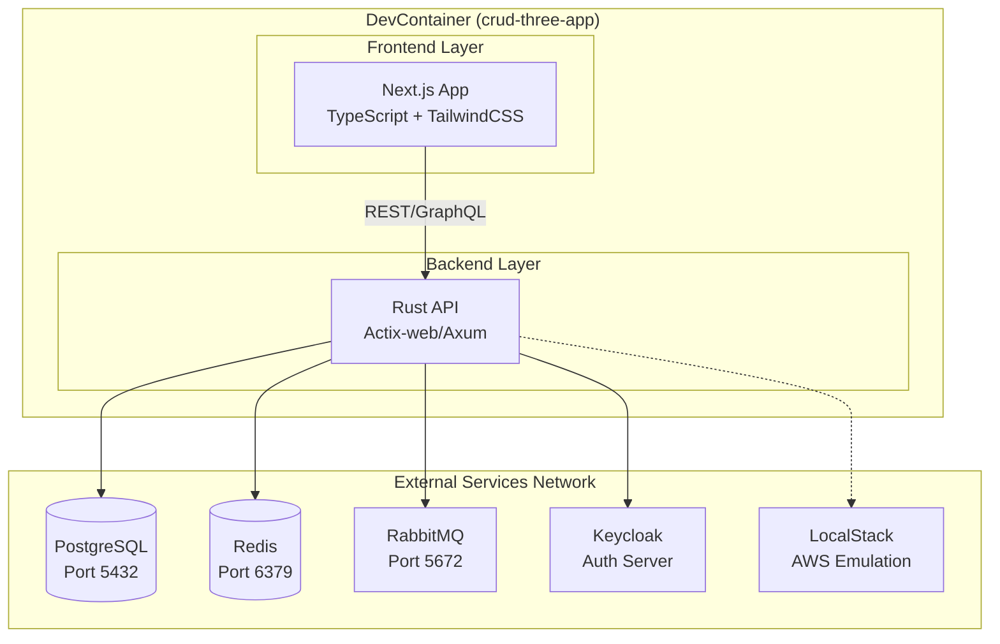
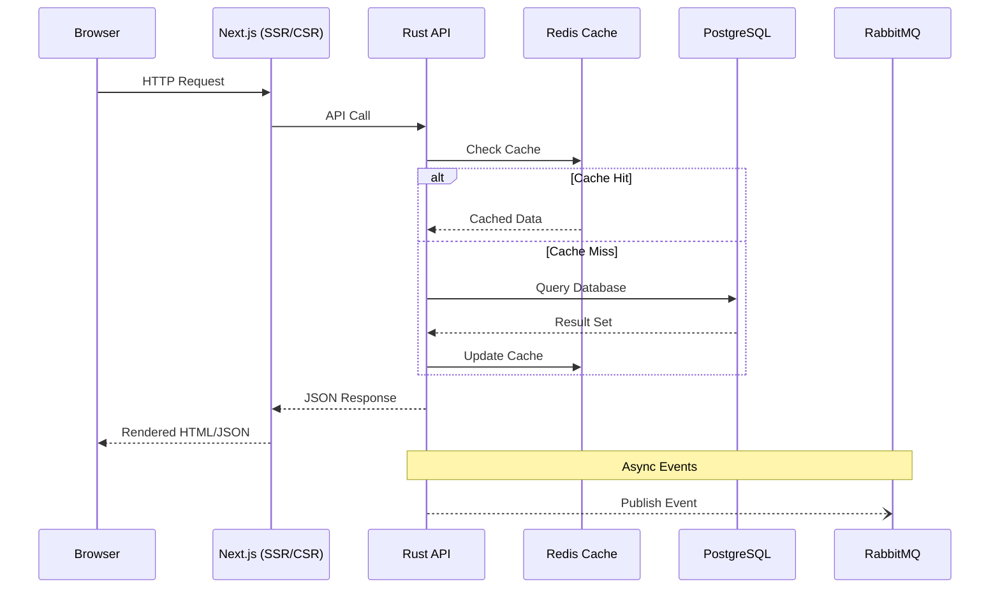
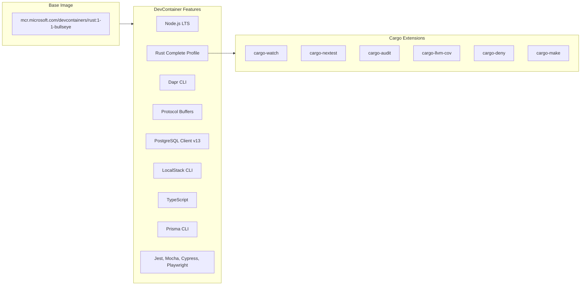
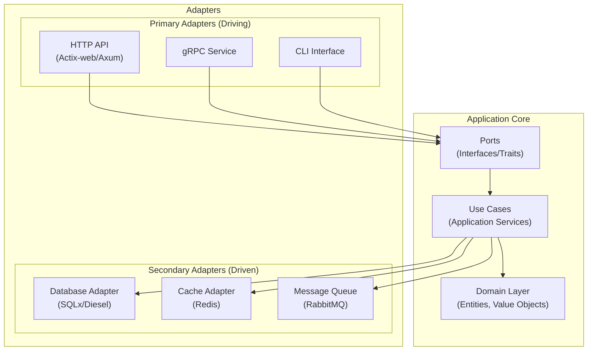
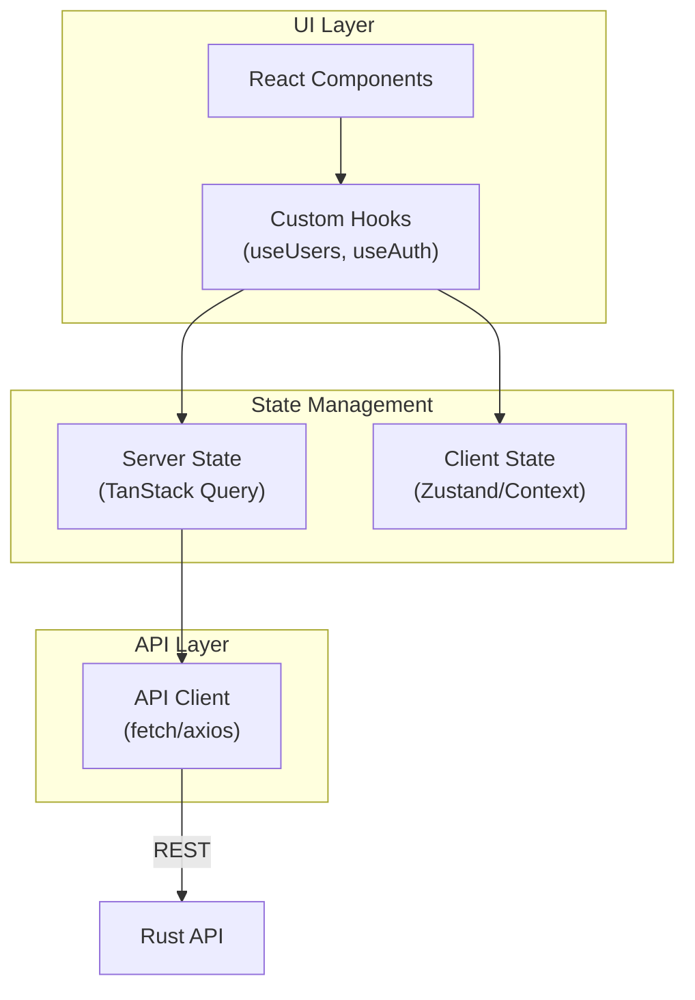

# Technical Analysis: CRUD Three App

Extensive technical analysis of the NextJS + Rust full-stack CRUD application scaffold.

## Table of Contents

- [Executive Summary](#executive-summary)
- [Architecture Analysis](#architecture-analysis)
- [DevContainer Deep Dive](#devcontainer-deep-dive)
- [Rust Backend Best Practices](#rust-backend-best-practices)
- [NextJS Frontend Patterns](#nextjs-frontend-patterns)
- [Security Analysis](#security-analysis)
- [Performance Recommendations](#performance-recommendations)

---

## Executive Summary

This project is a **full-stack scaffold** designed for building modern CRUD applications with:

- **Type-safe frontend** using Next.js with TypeScript
- **High-performance backend** using Rust
- **Containerized development** via VS Code DevContainers
- **Enterprise-ready infrastructure** with PostgreSQL, Redis, RabbitMQ, and Keycloak integration

### Current State

| Component      | Status      | Description                              |
| -------------- | ----------- | ---------------------------------------- |
| DevContainer   | ✅ Complete | Fully configured development environment |
| Infrastructure | ✅ Complete | Docker Compose with external network     |
| VS Code Config | ✅ Complete | Debug configs and extensions             |
| Frontend (ui/) | ⏳ Scaffold | Ready for Next.js implementation         |
| Backend (api/) | ⏳ Scaffold | Ready for Rust implementation            |

---

## Architecture Analysis

### High-Level Architecture



### Data Flow Architecture



---

## DevContainer Deep Dive

### Container Configuration Analysis



### Resource Allocation

| Resource | Limit   | Reservation | Rationale                             |
| -------- | ------- | ----------- | ------------------------------------- |
| Memory   | 8 GB    | 2 GB        | Rust compilation + Node.js dev server |
| CPUs     | 4 cores | 1 core      | Parallel cargo builds                 |

### Network Configuration

The DevContainer connects to an **external Docker network** for integration with:

- **Keycloak**: OAuth2/OIDC authentication
- **PostgreSQL**: Shared database infrastructure
- **Redis**: Distributed caching
- **RabbitMQ**: Message queuing

```yaml
networks:
  keycloak-dbs-brokers_backend_network:
    external: true
    driver: bridge
    subnet: 237.84.2.178/16
```

---

## Rust Backend Best Practices

### Recommended Architecture: Hexagonal (Ports and Adapters)



### Recommended Project Structure

```
api/
├── Cargo.toml
├── src/
│   ├── main.rs                 # Application entry point
│   ├── lib.rs                  # Library root
│   ├── config/                 # Configuration management
│   │   ├── mod.rs
│   │   └── settings.rs
│   ├── domain/                 # Domain layer (entities, value objects)
│   │   ├── mod.rs
│   │   ├── entities/
│   │   └── value_objects/
│   ├── application/            # Application layer (use cases)
│   │   ├── mod.rs
│   │   ├── services/
│   │   └── ports/              # Interface traits
│   ├── infrastructure/         # Infrastructure layer (adapters)
│   │   ├── mod.rs
│   │   ├── persistence/        # Database adapters
│   │   ├── cache/              # Redis adapter
│   │   └── messaging/          # RabbitMQ adapter
│   └── presentation/           # Presentation layer (HTTP handlers)
│       ├── mod.rs
│       ├── handlers/
│       ├── dto/                # Data Transfer Objects
│       └── middleware/
├── tests/
│   ├── integration/
│   └── e2e/
└── migrations/
```

### Recommended Crates

| Category           | Crate                  | Purpose                              |
| ------------------ | ---------------------- | ------------------------------------ |
| **Web Framework**  | `axum` or `actix-web`  | HTTP server and routing              |
| **Database**       | `sqlx`                 | Async SQL with compile-time checking |
| **Serialization**  | `serde` + `serde_json` | JSON serialization                   |
| **Async Runtime**  | `tokio`                | Async runtime                        |
| **Error Handling** | `thiserror` + `anyhow` | Error types                          |
| **Validation**     | `validator`            | Input validation                     |
| **Logging**        | `tracing`              | Structured logging                   |
| **Config**         | `config`               | Configuration management             |
| **Testing**        | `mockall`              | Mocking for tests                    |
| **Auth**           | `jsonwebtoken`         | JWT handling                         |

### Code Examples

#### Domain Entity

```rust
// src/domain/entities/user.rs
use serde::{Deserialize, Serialize};
use uuid::Uuid;

#[derive(Debug, Clone, Serialize, Deserialize)]
pub struct User {
    pub id: Uuid,
    pub email: String,
    pub name: String,
    pub created_at: chrono::DateTime<chrono::Utc>,
}

impl User {
    pub fn new(email: String, name: String) -> Self {
        Self {
            id: Uuid::new_v4(),
            email,
            name,
            created_at: chrono::Utc::now(),
        }
    }
}
```

#### Repository Trait (Port)

```rust
// src/application/ports/user_repository.rs
use async_trait::async_trait;
use crate::domain::entities::User;

#[async_trait]
pub trait UserRepository: Send + Sync {
    async fn create(&self, user: User) -> Result<User, RepositoryError>;
    async fn find_by_id(&self, id: uuid::Uuid) -> Result<Option<User>, RepositoryError>;
    async fn find_all(&self) -> Result<Vec<User>, RepositoryError>;
    async fn update(&self, user: User) -> Result<User, RepositoryError>;
    async fn delete(&self, id: uuid::Uuid) -> Result<(), RepositoryError>;
}
```

#### HTTP Handler

```rust
// src/presentation/handlers/user_handler.rs
use axum::{extract::State, Json};
use crate::application::services::UserService;

pub async fn create_user(
    State(service): State<Arc<UserService>>,
    Json(payload): Json<CreateUserRequest>,
) -> Result<Json<UserResponse>, AppError> {
    let user = service.create_user(payload.into()).await?;
    Ok(Json(user.into()))
}
```

---

## NextJS Frontend Patterns

### Recommended Project Structure

```
ui/
├── package.json
├── next.config.js
├── tailwind.config.js
├── tsconfig.json
├── src/
│   ├── app/                    # App Router (Next.js 13+)
│   │   ├── layout.tsx
│   │   ├── page.tsx
│   │   ├── users/
│   │   │   ├── page.tsx
│   │   │   └── [id]/
│   │   │       └── page.tsx
│   │   └── api/                # API Routes (if needed)
│   ├── components/
│   │   ├── ui/                 # Reusable UI components
│   │   ├── forms/              # Form components
│   │   └── layout/             # Layout components
│   ├── lib/
│   │   ├── api.ts              # API client
│   │   ├── utils.ts            # Utility functions
│   │   └── validators.ts       # Zod schemas
│   ├── hooks/                  # Custom React hooks
│   ├── types/                  # TypeScript types
│   └── styles/
│       └── globals.css
├── public/
└── tests/
    ├── unit/
    └── e2e/
```

### State Management Pattern



### Recommended Libraries

| Category          | Library                           | Purpose                    |
| ----------------- | --------------------------------- | -------------------------- |
| **Data Fetching** | `@tanstack/react-query`           | Server state management    |
| **Forms**         | `react-hook-form` + `zod`         | Form handling + validation |
| **Styling**       | `tailwindcss` + `shadcn/ui`       | UI components              |
| **State**         | `zustand`                         | Client-side state          |
| **Testing**       | `jest` + `@testing-library/react` | Unit testing               |
| **E2E Testing**   | `playwright`                      | End-to-end testing         |

---

## Security Analysis

### Current Security Features

| Feature                 | Status | Implementation                       |
| ----------------------- | ------ | ------------------------------------ |
| Non-root container user | ✅     | `remoteUser: vscode`                 |
| Dependency scanning     | ✅     | Dependabot + cargo-audit             |
| Network isolation       | ✅     | External network bridge              |
| Secret management       | ⚠️     | `.env` file (improve for production) |

### Recommended Security Enhancements

1. **Secret Management**
   - Use Docker secrets or AWS Secrets Manager
   - Never commit `.env` files with real credentials

2. **API Security**
   - Implement rate limiting
   - Use CORS configuration
   - Add request validation
   - Implement JWT authentication with Keycloak

3. **Database Security**
   - Use prepared statements (SQLx provides this)
   - Implement row-level security
   - Regular security audits with `cargo audit`

### Security Checklist

```
[ ] Move secrets to environment variables or secret manager
[ ] Configure CORS for production domains
[ ] Implement rate limiting on API endpoints
[ ] Add input validation on all endpoints
[ ] Set up HTTPS in production
[ ] Enable security headers (CSP, HSTS, etc.)
[ ] Regular dependency audits (cargo audit, npm audit)
[ ] Implement authentication with Keycloak
```

---

## Performance Recommendations

### Backend (Rust)

1. **Connection Pooling**

   ```rust
   // Use SQLx with connection pooling
   let pool = PgPoolOptions::new()
       .max_connections(10)
       .connect(&database_url)
       .await?;
   ```

2. **Caching Strategy**
   - Use Redis for frequently accessed data
   - Implement cache invalidation patterns
   - Consider read-through/write-through caching

3. **Async Operations**
   - Use `tokio` for async I/O
   - Implement connection pooling for external services
   - Use batch operations where possible

### Frontend (Next.js)

1. **Server-Side Rendering (SSR)**
   - Use SSR for SEO-critical pages
   - Implement ISR for semi-static content

2. **Client-Side Optimization**
   - Use React Query for data caching
   - Implement pagination for large lists
   - Use virtualization for long lists

3. **Bundle Optimization**
   - Enable Next.js automatic code splitting
   - Analyze bundle size with `@next/bundle-analyzer`
   - Lazy load below-the-fold components

### Performance Metrics Targets

| Metric                         | Target  | Tool           |
| ------------------------------ | ------- | -------------- |
| Time to First Byte (TTFB)      | < 200ms | Lighthouse     |
| First Contentful Paint (FCP)   | < 1.0s  | Lighthouse     |
| Largest Contentful Paint (LCP) | < 2.5s  | Lighthouse     |
| API Response Time (p95)        | < 100ms | cargo-llvm-cov |
| Database Query Time (p95)      | < 50ms  | SQLx logging   |

---

## VS Code Extension Analysis

### Essential Extensions

| Extension                          | Purpose              |
| ---------------------------------- | -------------------- |
| `rust-lang.rust-analyzer`          | Rust IDE support     |
| `ms-vscode.vscode-typescript-next` | TypeScript support   |
| `dbaeumer.vscode-eslint`           | JavaScript linting   |
| `esbenp.prettier-vscode`           | Code formatting      |
| `vadimcn.vscode-lldb`              | Rust debugging       |
| `ms-vscode.live-server`            | Frontend development |

### AI Assistance Extensions

| Extension                 | Purpose              |
| ------------------------- | -------------------- |
| `GitHub.copilot`          | AI code completion   |
| `Anthropic.claude-code`   | Claude AI assistance |
| `Codeium.codeium`         | Free AI completion   |
| `google.geminicodeassist` | Gemini AI support    |

---

## Conclusion

This scaffold provides a solid foundation for building a production-ready full-stack application. The DevContainer setup ensures consistent development environments, while the recommended architecture patterns (Hexagonal for Rust, App Router for Next.js) promote maintainability and testability.

### Next Steps

1. Initialize the Rust API project with `cargo init api`
2. Initialize the Next.js UI with `npx create-next-app@latest ui`
3. Implement the domain entities and use cases
4. Set up authentication with Keycloak
5. Build out CRUD operations
6. Add comprehensive testing

---

_Analysis generated: February 2026_
